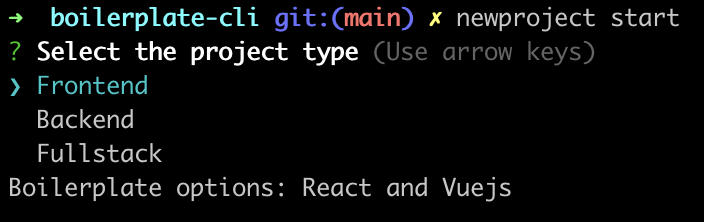

<p align="center">
  <h1 align="center">Boilerplate-cli</h1>
</p>

<p align="center">
  <a aria-label="Javascript logo" href="https://developer.mozilla.org/">
    
  </a>
  <a aria-label="Node.js logo" href="https://nodejs.org/">
    
  </a>
  <a aria-label="CLI logo">
    
  </a>
</p> 

## Docs in other language 

[Click here](https://github.com/lucasprochnow2/boilerplate-cli/blob/main/README-EN.md#boilerplate-cli) to read the docs in english.

## Descrição

CLI desenvolvido em javascript que serve para facilitar o bootstrap de aplicações no seu terminal. Veja abaixo como instalar e utilizar o CLI.

## Instalação

1. Faça o clone desse projeto para o seu computador executando o comando abaixo no seu terminal: 
```zsh
git clone https://github.com/lucasprochnow2/boilerplate-cli.git
```
2. Instale as dependências do projeto executando o comando abaixo no terminal:
```zsh
yarn
```
3. Instale o CLI globalmente executando o comando abaixo no terminal:
```zsh
npm link
```

Feito! Agora você já consegue rodar o boilerplate-cli no seu terminal globalmente! Rode o comando abaixo no terminal para iniciar o CLI:

```zsh
newproject start
```

Se tudo estiver correto, um menu de opções como no print abaixo deve aparecer no terminal:



## Detalhes sobre o comando start

O comando `start` serve para iniciar uma aplicação nova no seu ambiente local. As opções disponíveis para o setup da aplicação são: 
- React e VueJS - para a categoria "Frontend";
- NodeJS - para a categoria "Backend";
- NextJS - para a categoria "Fullstack".

### Idioma (`--lang`)

O idioma do menu de setup pode ser alterado utilizando a flag `--lang` ou `-l` depois do comando `start`. 

O idioma padrão dos menus é `en` e os idiomas disponíveis são: `pt` e `en`.

Para mudar o idioma, rode o comando abaixo:
```zsh
newproject start --lang pt
```
ou 
```zsh
newproject start -l pt
```

### Ajuda (`--help`)

Flag que mostra todos os detalhes sobre o comando `start`. Pode ser substituída pela forma resumida da flag `-l` também.

Para abrir as informações de ajuda, rode o comando abaixo:
```zsh
newproject start --help
```
ou 
```zsh
newproject start -h
```

## Libs usadas para implementação

### Commander

Lib NodeJS bem completa para criar CLI's: https://github.com/tj/commander.js#readme

### Inquirer.js

Lib que disponibiliza interfaces interativas para que o usuário possa interagir com o terminal: https://github.com/SBoudrias/Inquirer.js#inquirer

### Chalk

Lib que possibilita adicionar estilo ao texto do terminal: https://github.com/chalk/chalk#

### ShellJS

Permite que comandos shell sejam executados no terminal: https://github.com/shelljs/shelljs
